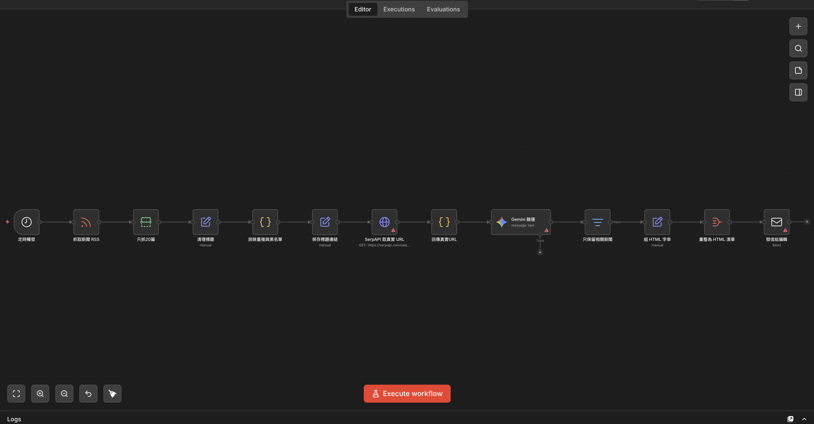
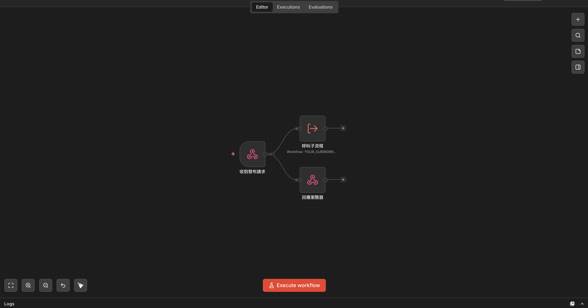
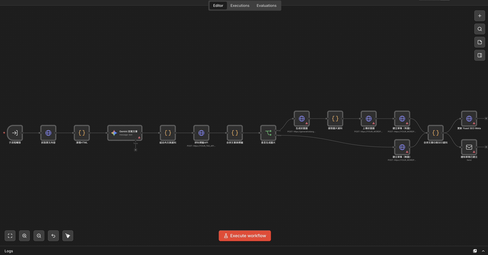
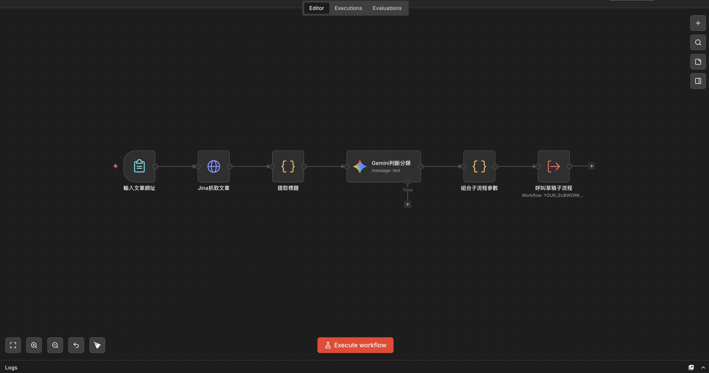

# 📰 Content Automation Pipeline n8n + Gemini + WordPress

English | [繁體中文](#-內容自動化流程-n8n--gemini--wordpress)

An n8n-based content automation pipeline. Periodically fetches RSS news, uses Gemini AI to filter and rewrite articles, then automatically creates WordPress drafts and notifies your editor.

---

## ✨ What it does

1. **Fetch** — Pull RSS from Google News on a schedule, resolve real article URLs via SerpAPI
2. **Filter** — Gemini decides if each article fits your site (you define the criteria in the prompt)
3. **Email digest** — Relevant articles are sent to the editor as a clickable HTML list
4. **One-click draft** — Editor clicks a link in the email → Webhook triggers the sub-workflow → Gemini rewrites the article in your own words → WordPress draft created with SEO meta and tags
5. **Notify** — Editor receives an email with a direct link to the draft and a cover image prompt (paste into free Gemini or ChatGPT to generate an image)

---

## 🏗 Architecture

### Workflow 1 — Scheduled digest email (`news-digest.json`)



Cron → RSS fetch → Gemini filter (isRelevant + category + summary) → drop irrelevant → SerpAPI URL resolution (only for articles that pass) → HTML digest → email to editor. Each article has two buttons: **[✍️ Generate draft + cover]** and **[✍️ Generate draft]**, which trigger the webhook on click.

### Workflow 2 — Webhook receiver (`draft-trigger.json`)



Receives request (title, url, category, generateImage) → immediately responds to browser (avoid timeout) → calls sub-workflow asynchronously.

### Workflow 3 — Draft creation sub-workflow (`create-draft.json`)



Fetch & clean article HTML → Gemini rewrite (structured output: paragraphs, SEO, slug, tags, image prompt) → call wp-tag-resolver → [optional] Gemini image generation → create WordPress draft → update Yoast SEO meta → send notification email.

### Workflow 4 — Manual URL draft entry (`manual-url-draft.json`)



Paste any article URL → Jina fetches the article and extracts the title → Gemini classifies the category → calls the `create-draft.json` sub-workflow. The form responds immediately; the draft is built in the background and the editor is notified by email when done.

> Deploy one copy per editor. Replace `YOUR_AUTHOR_ID` with that editor's WordPress username so each person gets their own link without needing to select an author in the form.

### `wp-tag-resolver/` — Express microservice

`POST /resolve-tags { tags: ["Tag A", "Tag B"] }` → query WordPress Tags API, create if missing → return `{ tagIds: [123, 456] }`

---

## 🔧 Requirements

| Service | Purpose | Cost |
|---------|---------|------|
| [n8n](https://n8n.io) | Workflow automation | Free self-host / Cloud paid |
| [Google Gemini API](https://aistudio.google.com) | Filter + rewrite + image generation | Free tier / usage-based |
| [SerpAPI](https://serpapi.com) | Resolve real URLs from Google News | 100 free/month |
| WordPress | Draft destination | Self-hosted |
| SMTP | Email sending (Gmail, Resend, etc.) | Free |
| Any Node.js host | Deploy wp-tag-resolver | Free tier (Zeabur, Railway, Render) |

---

## 🚀 Setup

### 1. Deploy wp-tag-resolver

```bash
cd wp-tag-resolver
npm install

export WP_BASE_URL=https://your-site.com
export WP_USERNAME=your-wp-username
export WP_APP_PASSWORD="xxxx xxxx xxxx xxxx xxxx xxxx"

node index.js
```

Generate a WordPress Application Password: Dashboard → Users → Profile → Application Passwords.

### 2. Create credentials in n8n

| Credential | Type | Notes |
|------------|------|-------|
| Google Gemini API | Google PaLM API | Your Gemini API key |
| x-goog-api-key | HTTP Header Auth | Header name `x-goog-api-key`, value = Gemini API key |
| WordPress Application Password | HTTP Basic Auth | Username + application password |
| SerpAPI account | SerpAPI | Your SerpAPI key |
| SMTP account | SMTP | Your mail server settings |

### 3. Import workflows

1. Import `create-draft.json` first — copy its Workflow ID
2. Import `draft-trigger.json` — set `YOUR_SUBWORKFLOW_ID` in the "呼叫子流程" node
3. Import `news-digest.json`
4. (Optional) Import `manual-url-draft.json` — set `YOUR_SUBWORKFLOW_ID` in the "Call Draft Sub-workflow" node and replace `YOUR_AUTHOR_ID` with a WordPress username; deploy one copy per editor

### 4. Replace placeholders

| Placeholder | Replace with |
|------------|-------------|
| `YOUR_KEYWORDS` | URL-encoded search terms for Google News RSS |
| `YOUR_WORDPRESS_URL` | Your WordPress site URL (no trailing slash) |
| `YOUR_WP_CREDENTIAL_ID` | ID of the WordPress credential saved in n8n |
| `YOUR_WP_USER_ID` | WordPress user ID (visible in the user edit URL in wp-admin) |
| `YOUR_EMAIL` | Email to receive draft notifications |
| `YOUR_EDITOR_EMAIL` | Email to receive the digest |
| `YOUR_GEMINI_CREDENTIAL_ID` | ID of the Gemini (PaLM) credential saved in n8n |
| `YOUR_GEMINI_API_KEY_CREDENTIAL_ID` | ID of the HTTP Header Auth credential saved in n8n |
| `YOUR_SERPAPI_CREDENTIAL_ID` | ID of the SerpAPI credential saved in n8n |
| `YOUR_SMTP_CREDENTIAL_ID` | ID of the SMTP credential saved in n8n |
| `YOUR_SMTP_FROM_EMAIL` | Sender email address |
| `YOUR_TAG_API_URL` | Deployed URL of wp-tag-resolver |
| `YOUR_N8N_DOMAIN` | Your n8n public URL (webhook must be externally reachable) |
| `YOUR_SUBWORKFLOW_ID` | Workflow ID of create-draft.json |
| `YOUR_CATEGORY_ID` | WordPress category ID (wp-admin → Posts → Categories) |
| `YOUR_AUTHOR_ID` | WordPress username for the editor (manual-url-draft.json only) |
| `YOUR_FORM_WEBHOOK_ID` | Any unique string used as the form URL path (manual-url-draft.json only) |
| `YOUR_DEFAULT_CATEGORY` | Fallback category name when Gemini cannot classify (manual-url-draft.json only) |

### 5. Customize prompts

In `news-digest.json`, replace `CATEGORY_A/B/C` in the Gemini filter prompt with your actual site categories.

In `create-draft.json`, update the `categoryMap` in the "組合內文與資料" node to match your WordPress categories.

### 6. Activate

Enable all workflows. `news-digest.json` runs on cron (default: Monday, Wednesday, Friday at 08:00). `manual-url-draft.json` becomes available via the n8n-hosted form URL as soon as it is activated.

---

## ⚙️ Customization

- **RSS keywords** — Edit the `q=` parameter in the RSS URL inside `news-digest.json`
- **Schedule** — Change the cron expression in the "定時觸發" node
- **Blocked sources** — Edit the `blockedSources` array in the "排除重複與黑名單" node
- **Cover image** — The notification email includes an AI-generated image prompt. Paste it into free Gemini or ChatGPT to create an image, then upload manually. Pass `generateImage=true` to have the workflow call the Gemini Image API automatically (incurs API cost per image).
- **Draft marker block** — Each draft begins with a `<div class="auto-draft">` block, and you may see a few "block contains unexpected or invalid content" notices in the editor. These are traces left by the automation workflow and do not affect the layout. You can ignore them.

---

## 📄 License

MIT

---

## ☕ Buy me a coffee

If this project has been helpful, feel free to buy me a coffee ☕

[](https://ko-fi.com/no30131)

Also feel free to check out my YouTube channel 🎬 [Melody's Flow](https://www.youtube.com/@MelodysFlow)

---

# 📰 內容自動化流程 n8n + Gemini + WordPress

[English](#-content-automation-pipeline-n8n--gemini--wordpress) | 繁體中文

一套以 n8n 為核心的內容自動化流程。定期從 RSS 抓取新聞，用 Gemini 篩選並改寫文章，自動建立 WordPress 草稿並通知編輯上架。

---

## ✨ 它做什麼

1. **抓取** — 定時從 Google News RSS 撈新聞，透過 SerpAPI 解析真實文章連結
2. **篩選** — Gemini 判斷每篇是否符合你的網站定位（篩選條件在 prompt 裡自訂）
3. **Email 摘要** — 通過篩選的文章整理成 HTML 清單，寄給編輯
4. **一鍵建稿** — 編輯點信裡的按鈕 → Webhook 觸發子流程 → Gemini 用自己的文字改寫原文 → 自動建立 WordPress 草稿，含 SEO meta 與標籤
5. **通知** — 寄信給編輯，附上草稿編輯頁連結與封面圖生成 Prompt（可直接貼到 Gemini 免費版生圖）

---

## 🏗 架構

### Workflow 1 — 定期摘要信（`news-digest.json`）


Cron 觸發 → RSS 抓取 → Gemini 篩選（isRelevant + 分類 + 摘要）→ 過濾不相關 → SerpAPI 取真實 URL（僅對通過篩選的文章）→ 組 HTML 清單 → 寄信給編輯。信件內每篇文章有兩個按鈕：**[✍️ 生成草稿+封面圖]** 與 **[✍️ 生成草稿]**，點擊即觸發 Webhook。

### Workflow 2 — Webhook 接收器（`draft-trigger.json`）


接收請求（title, url, category, generateImage）→ 立即回應瀏覽器（避免逾時）→ 非同步呼叫子流程。

### Workflow 3 — 建立草稿（`create-draft.json`）


抓取原文 HTML → Gemini 改寫文章（結構化輸出：段落、SEO、slug、標籤、圖片提示詞）→ 呼叫 wp-tag-resolver → [選] Gemini 生成封面圖 → 建立 WordPress 草稿 → 更新 Yoast SEO Meta → 寄通知信。

### Workflow 4 — 手動輸入 URL 建稿（`manual-url-draft.json`）


貼上任意文章網址 → Jina 抓取原文並提取標題 → Gemini 判斷分類 → 呼叫 `create-draft.json` 子流程。表單送出後立即回應，草稿在背景建立，完成後寄信通知。

> 每位上稿者各部署一份，將 `YOUR_AUTHOR_ID` 替換為該使用者的 WordPress 使用者名稱，即可用獨立連結觸發且無需在表單中選擇作者。

### `wp-tag-resolver/` — Express 微服務

`POST /resolve-tags { tags: ["標籤A", "標籤B"] }` → 查詢 WordPress Tags API，不存在則建立 → 回傳 `{ tagIds: [123, 456] }`

---

## 🔧 需要的服務

| 服務 | 用途 | 費用 |
|------|------|------|
| [n8n](https://n8n.io) | 流程自動化 | 自架免費 / Cloud 付費 |
| [Google Gemini API](https://aistudio.google.com) | 篩選 + 改寫 + 生成圖片 | 免費額度 / 依用量 |
| [SerpAPI](https://serpapi.com) | 解析 Google News 真實連結 | 每月 100 次免費 |
| WordPress | 草稿目標站 | 自架 |
| SMTP | 寄信（Gmail、Resend 等） | 免費 |
| 任意 Node.js 主機 | 部署 wp-tag-resolver | 免費方案可用（Zeabur、Railway、Render） |

---

## 🚀 設定

### 1. 部署 wp-tag-resolver

```bash
cd wp-tag-resolver
npm install

export WP_BASE_URL=https://your-site.com
export WP_USERNAME=your-wp-username
export WP_APP_PASSWORD="xxxx xxxx xxxx xxxx xxxx xxxx"

node index.js
```

產生 WordPress 應用程式密碼：後台 → 使用者 → 個人資料 → 應用程式密碼。

### 2. 在 n8n 建立憑證

| 憑證 | 類型 | 備註 |
|------|------|------|
| Google Gemini API | Google PaLM API | 你的 Gemini API 金鑰 |
| x-goog-api-key | HTTP Header Auth | Header 名稱 `x-goog-api-key`，值 = Gemini API 金鑰 |
| WordPress Application Password | HTTP Basic Auth | 使用者名稱 + 應用程式密碼 |
| SerpAPI account | SerpAPI | 你的 SerpAPI 金鑰 |
| SMTP account | SMTP | 你的郵件伺服器設定 |

### 3. 匯入工作流程

1. 先匯入 `create-draft.json` — 複製其 Workflow ID
2. 匯入 `draft-trigger.json` — 在「呼叫子流程」節點填入 `YOUR_SUBWORKFLOW_ID`
3. 匯入 `news-digest.json`
4. （選用）匯入 `manual-url-draft.json` — 在「Call Draft Sub-workflow」節點填入 `YOUR_SUBWORKFLOW_ID`，並將 `YOUR_AUTHOR_ID` 替換為 WordPress 使用者名稱；每位上稿者部署一份

### 4. 替換佔位符

| 佔位符 | 替換為 |
|--------|--------|
| `YOUR_KEYWORDS` | URL 編碼的 Google News RSS 搜尋關鍵字 |
| `YOUR_WORDPRESS_URL` | WordPress 站台網址（末尾不加斜線） |
| `YOUR_WP_CREDENTIAL_ID` | n8n 中儲存的 WordPress 憑證 ID |
| `YOUR_WP_USER_ID` | WordPress 使用者 ID（在 wp-admin 使用者編輯頁的網址中可見） |
| `YOUR_EMAIL` | 接收草稿通知的 Email |
| `YOUR_EDITOR_EMAIL` | 接收摘要信的 Email |
| `YOUR_GEMINI_CREDENTIAL_ID` | n8n 中儲存的 Gemini (PaLM) 憑證 ID |
| `YOUR_GEMINI_API_KEY_CREDENTIAL_ID` | n8n 中儲存的 HTTP Header Auth 憑證 ID |
| `YOUR_SERPAPI_CREDENTIAL_ID` | n8n 中儲存的 SerpAPI 憑證 ID |
| `YOUR_SMTP_CREDENTIAL_ID` | n8n 中儲存的 SMTP 憑證 ID |
| `YOUR_SMTP_FROM_EMAIL` | 寄件者 Email 地址 |
| `YOUR_TAG_API_URL` | wp-tag-resolver 的部署網址 |
| `YOUR_N8N_DOMAIN` | 你的 n8n 公開網址（Webhook 必須可從外部連線） |
| `YOUR_SUBWORKFLOW_ID` | create-draft.json 的 Workflow ID |
| `YOUR_CATEGORY_ID` | WordPress 分類 ID（wp-admin → 文章 → 分類） |
| `YOUR_AUTHOR_ID` | WordPress 使用者名稱（manual-url-draft.json 專用） |
| `YOUR_FORM_WEBHOOK_ID` | 任意不重複的字串，作為表單網址的路徑（manual-url-draft.json 專用） |
| `YOUR_DEFAULT_CATEGORY` | Gemini 無法判斷時的備援分類名稱（manual-url-draft.json 專用） |

### 5. 自訂 Prompt

在 `news-digest.json` 中，將 Gemini 篩選 prompt 裡的 `CATEGORY_A/B/C` 替換成你網站的實際分類。

在 `create-draft.json` 中，更新「組合內文與資料」節點裡的 `categoryMap`，對應你的 WordPress 分類。

### 6. 啟用

啟用全部工作流程。`news-digest.json` 依排程執行（預設：每週一、三、五 08:00）。`manual-url-draft.json` 啟用後即可透過 n8n 提供的表單網址使用。

---

## ⚙️ 自訂

- **RSS 關鍵字** — 修改 `news-digest.json` 中 RSS 網址的 `q=` 參數
- **排程** — 修改「定時觸發」節點的 cron 表達式
- **封鎖來源** — 修改「排除重複與黑名單」節點的 `blockedSources` 陣列
- **封面圖** — 通知信內附有 AI 生成的圖片 Prompt，可貼到 Gemini 或 ChatGPT 免費版生圖後手動上傳；或傳入 `generateImage=true` 讓流程自動呼叫 Gemini Image API 生圖（每張需額外 API 費用）
- **草稿標記區塊** — 草稿內文開頭會有一個 `<div class="auto-draft">` 標記區塊，內文也會有幾個「區塊包含未預期或無效的內容。」，這是自動化流程留下的識別標籤，不影響排版，可直接忽略。

---

## 📄 授權

MIT

---

## ☕ Buy me a coffee

如果這個專案對你有幫助，歡迎請我喝杯咖啡 ☕

[](https://ko-fi.com/no30131)

也歡迎訂閱我的 YouTube 頻道 🎬 [Melody's Flow | 軟體手作與日常隨筆](https://www.youtube.com/@MelodysFlow)
